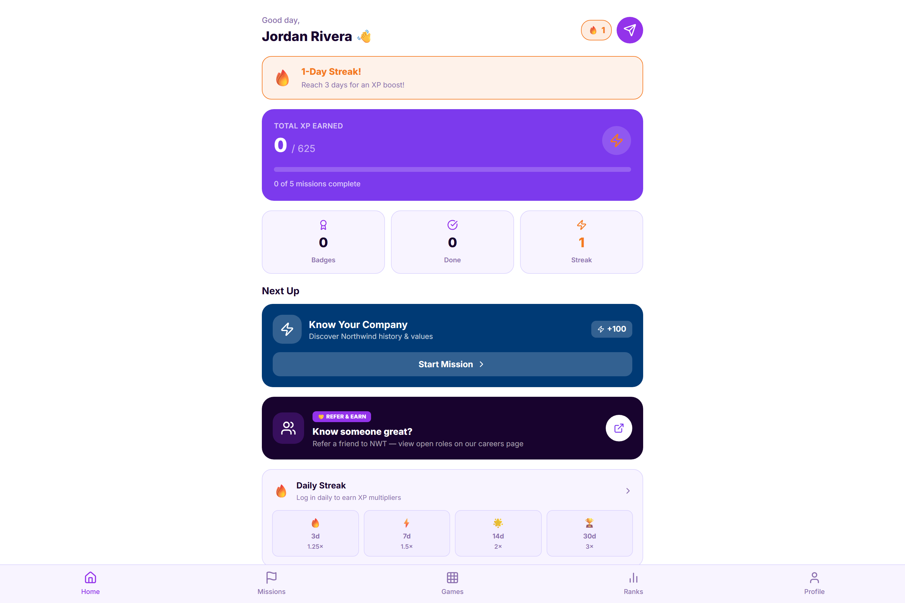
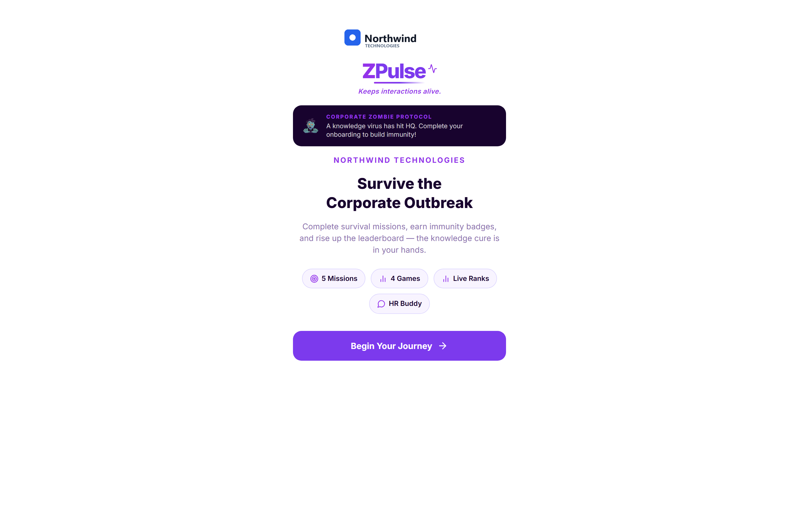
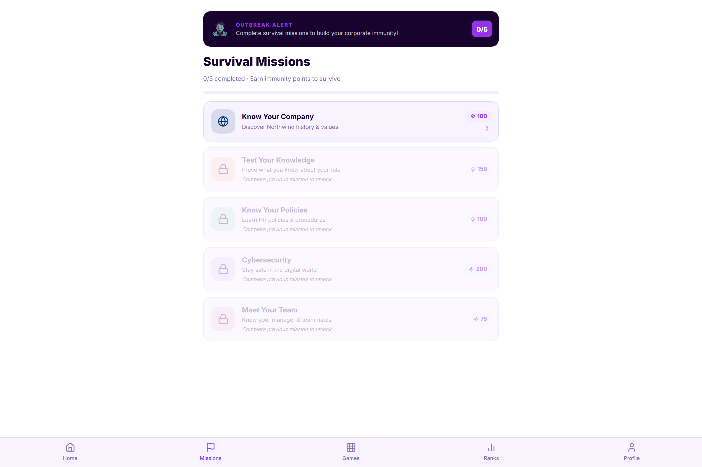
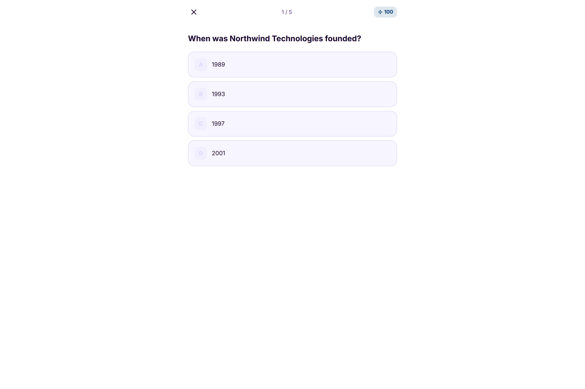
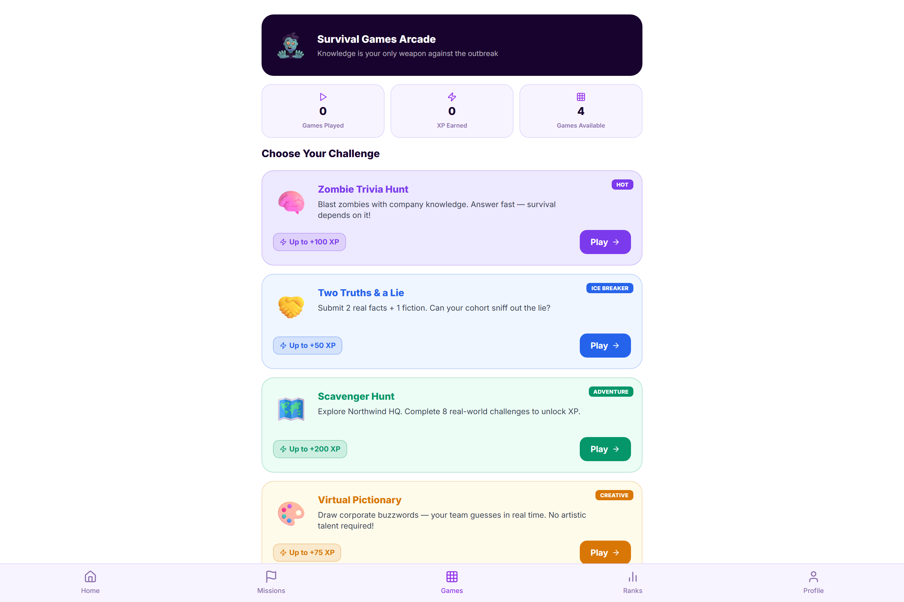
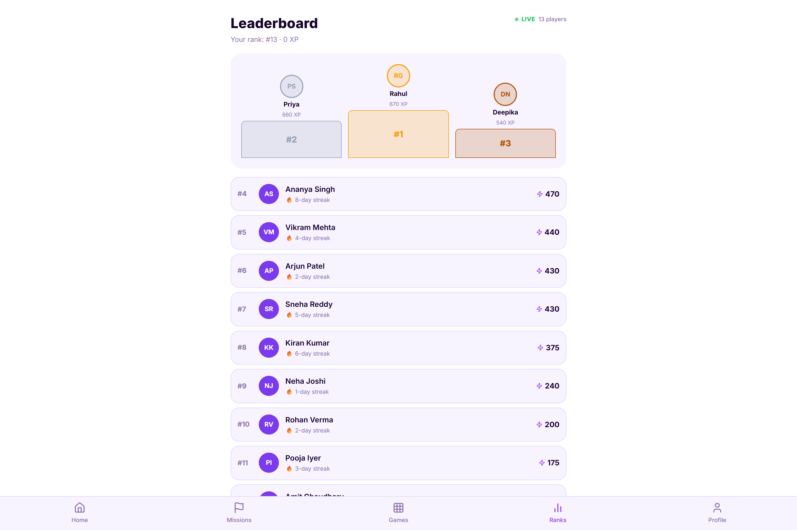
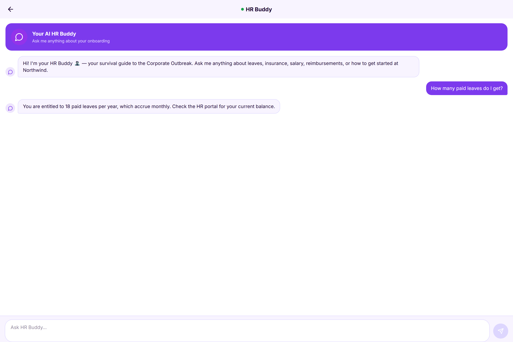
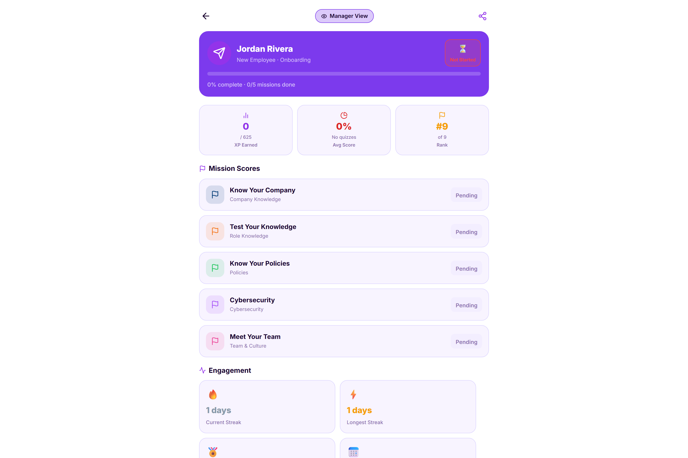

# Z Pulse — Candidate Pre-Boarding

An engagement app for the strangest gap in hiring: the weeks between a candidate accepting your offer and actually turning up on day one. In markets with long notice periods that gap runs to two or three months, the company usually goes quiet for most of it, and a large share of accepted candidates never join — they take a counter-offer, or simply stop replying. Z Pulse fills that silence with something a candidate actually wants to open: missions, games, streaks, a leaderboard, and an assistant that answers the questions people are too embarrassed to email HR about.

## What it does

- **Starts the moment the offer is accepted** — the window it covers runs from offer-accept to the first day, which is exactly where the drop-out risk sits.
- **Gives a reason to come back daily** — streaks and XP turn a long, silent notice period into a habit rather than a void.
- **Teaches the company through missions** — short themed missions, each ending in a five-question quiz worth XP, so a new joiner arrives already knowing how things work.
- **Makes it social** — a leaderboard across incoming joiners, so the cohort meets each other before day one.
- **Includes actual games** — pictionary, two truths and a lie, and a scavenger hunt, rather than a checklist pretending to be a game.
- **Answers HR questions on demand** — a built-in assistant handles leave, insurance, IT and policy questions conversationally, at any hour.
- **Gives managers a view** — a dashboard showing how engaged each incoming joiner is, so a disengaging candidate can be spotted before they disappear.
- **Counts down to day one** — with notification preferences the candidate controls.

## Screens

Everything shown uses a fictional employer and invented candidate data.

### Welcome
The entry screen a candidate lands on after accepting the offer.

### Home
The hub — progress, streak, XP and what to do next.

### Missions
The mission list, each one a themed introduction to part of the company.

### Inside a mission
A mission quiz question, scored for XP.

### Games
The games hub — pictionary, two truths and a lie, and a scavenger hunt.

### Leaderboard
Standings across the incoming cohort.

### HR assistant
The built-in assistant answering an onboarding question in conversation.

### Manager dashboard
The manager's view of incoming joiners and their engagement.

## Status

I worked out where this belongs in the candidate journey — that the gamified core earns its keep specifically in the accept-to-day-one window, not earlier during interviewing and not after joining — and then built this working implementation of it. Every screen above is running software, and the HR assistant answers live rather than replaying canned text. It is a complete working product rather than a mockup, though it stands alone here: the handoff into a real applicant-tracking and onboarding system is designed but not shown.

---

*Source code is not published. This repository is a visual walkthrough of the working application.*
