# Z Pulse — Candidate Pre-Boarding

An engagement platform for the strangest gap in hiring: the weeks between a candidate accepting your offer and actually turning up on day one. Where notice periods run to two or three months, the employer usually goes quiet for most of it — and a large share of accepted candidates never join, taking a counter-offer or simply going silent. Z Pulse fills that gap with something a candidate will actually open: missions, quizzes, games, streaks, a cohort leaderboard, an always-available HR assistant, and a verifiable certificate at the end. Behind it sits a staff side — HR, hiring managers and admins — that can see who is engaged and who is drifting.

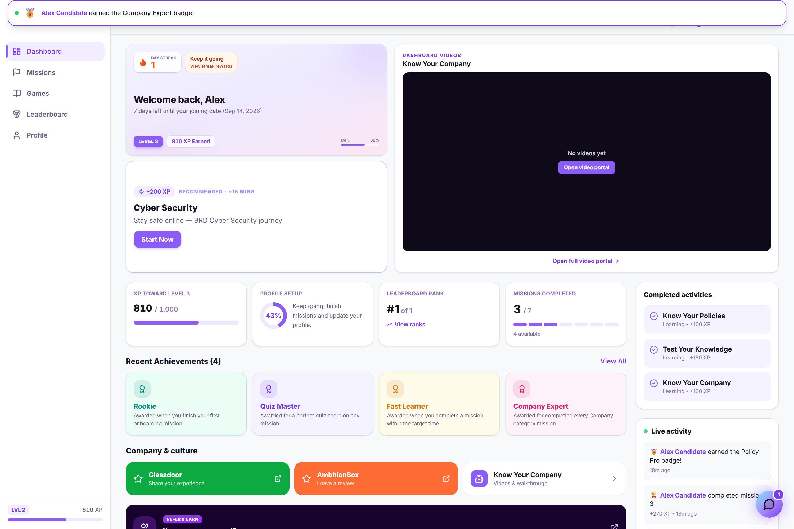

## What it does

**For the incoming hire**

- **Gives a reason to come back daily** — streaks and XP turn a long, silent notice period into a habit.
- **Teaches the company through missions** — themed missions, each ending in a scored quiz, so a joiner arrives already knowing how things work.
- **Includes real games** — a scavenger hunt, pictionary and two-truths, not a checklist wearing a game's clothing.
- **Answers HR questions on demand** — a built-in assistant handles leave, insurance, IT and policy questions conversationally, at any hour.
- **Ranks the cohort** — a leaderboard so incoming joiners meet each other before day one.
- **Issues a real certificate** — completing a mission produces a verifiable certificate with its own code and public verification page, shareable to a professional profile.

**For the people hiring**

- **Pulls the hire list from the applicant-tracking system** — joiners are synced in rather than typed in, and each one's portal status is tracked from invite to first login.
- **Shows who has actually engaged** — HR analytics covering quiz performance, time spent, and location, with exportable reports.
- **Separates the audiences** — distinct dashboards for HR, the hiring manager, and an administrator, each seeing the slice relevant to them.

## Screens

Everything shown uses a fictional employer, a fictional applicant-tracking system, and invented candidate data.

### Home
The candidate's hub — progress, streak, XP and what to do next.

### Missions
The mission list, each a themed introduction to part of the company.
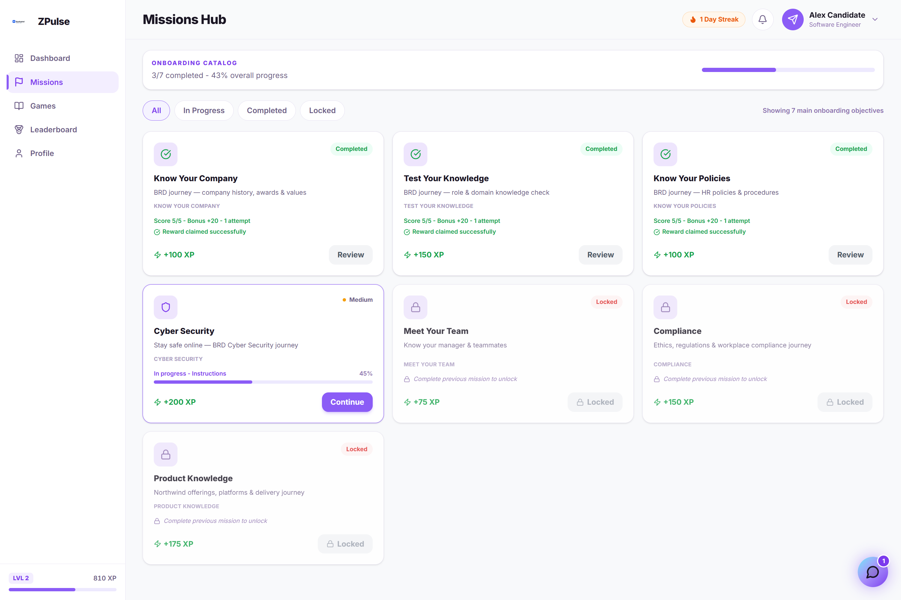

### Inside a mission
A mission quiz question, scored for XP.
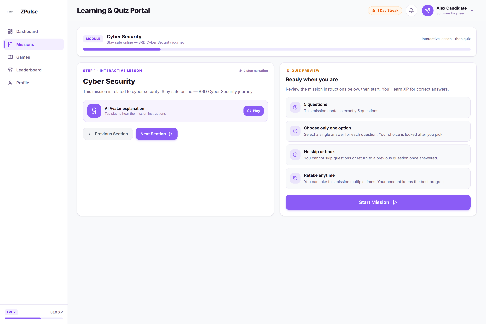

### Scavenger hunt
One of the games in the engagement loop.
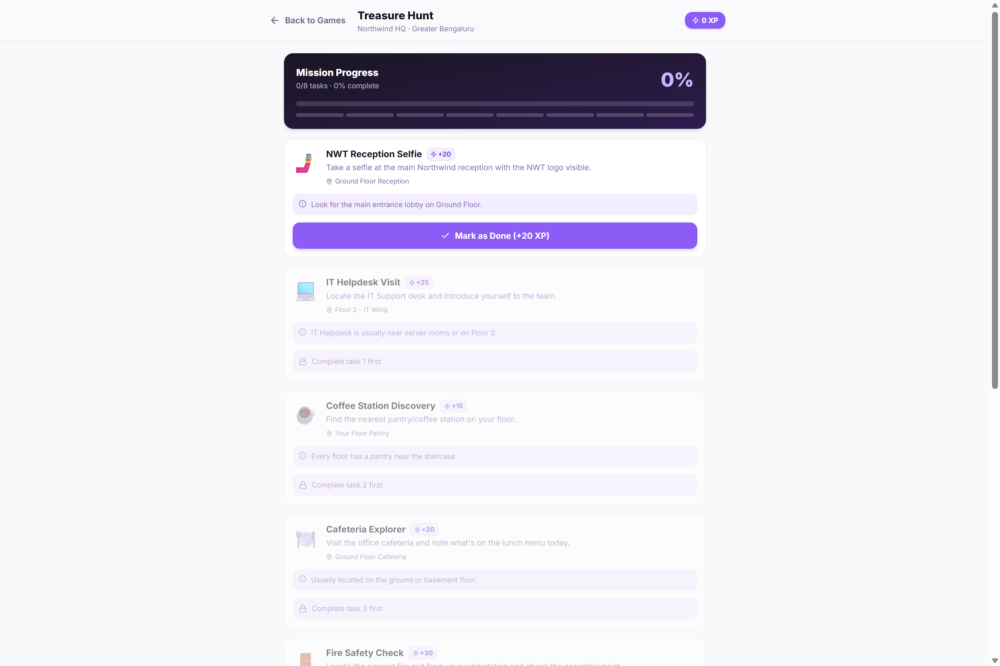

### Pictionary
A drawing game, played in-app.
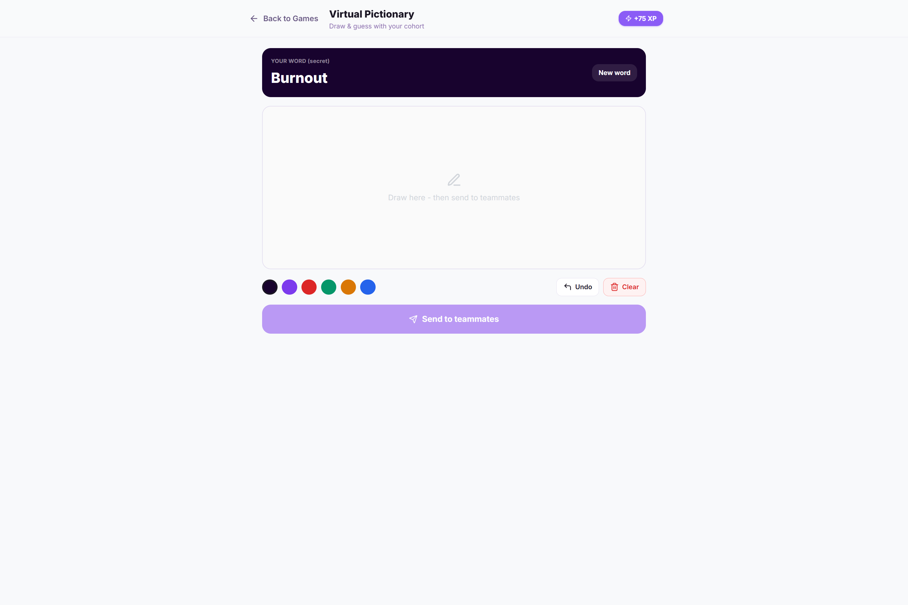

### Streak
The daily-return mechanic that keeps the notice period from going quiet.
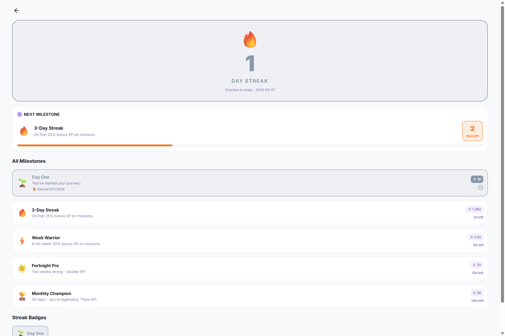

### Profile
The candidate's own progress, badges and standing.
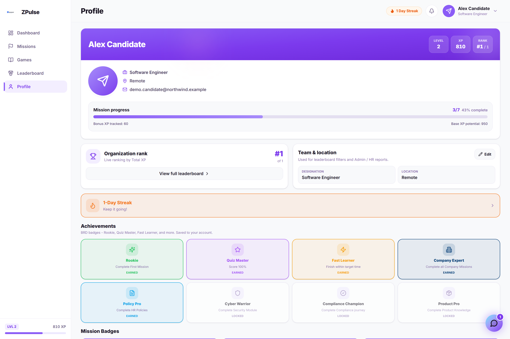

### HR assistant
The built-in assistant answering an onboarding question in conversation.
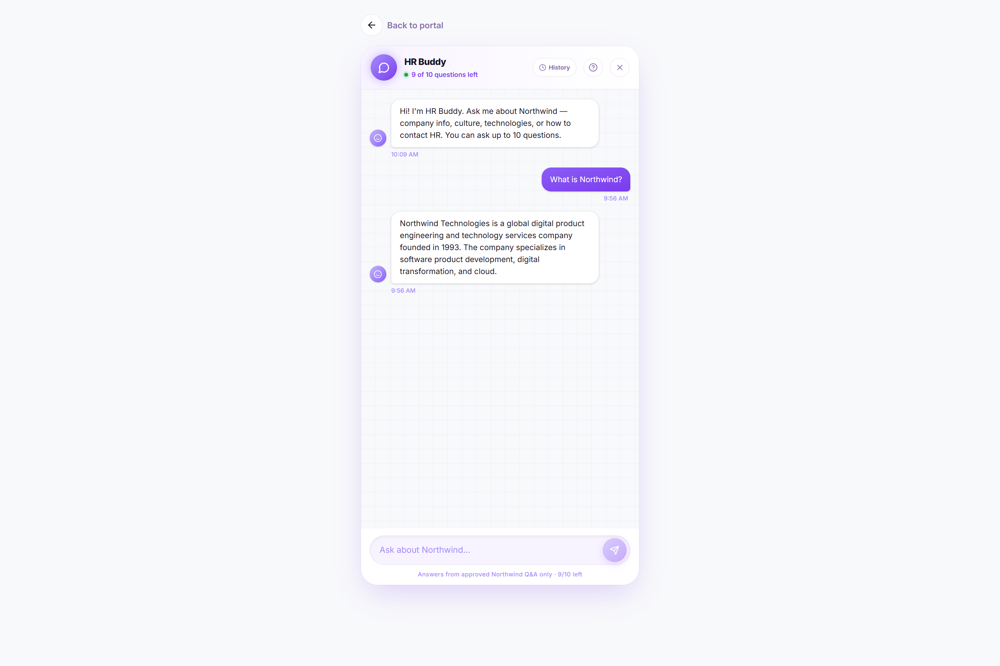

### Certificate
A generated certificate with its verification code and a public verification page.
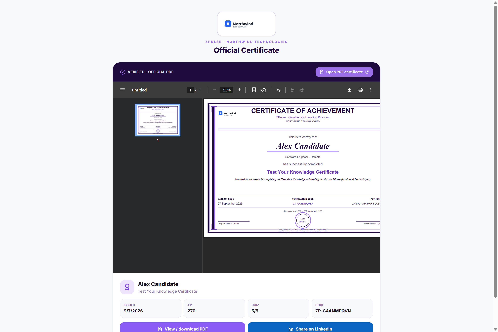

### HR analytics
The HR view — synced hires, portal status per person, quiz and time analytics, and report export.
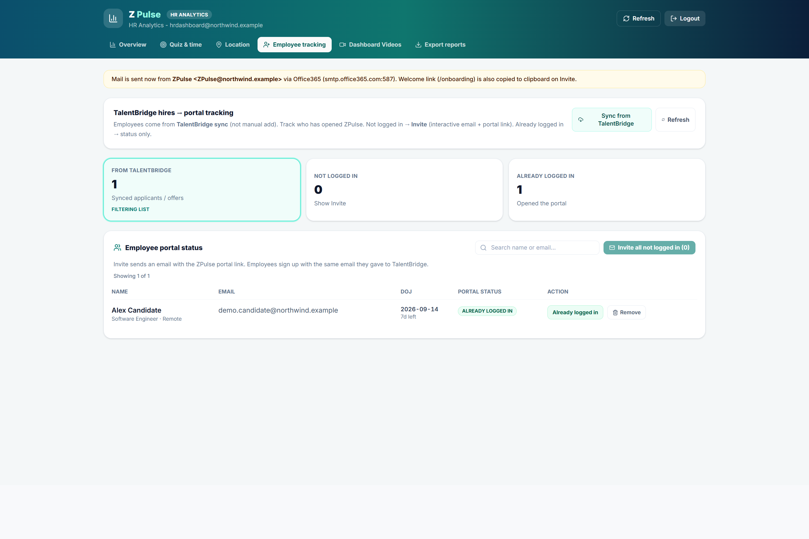

### Hiring manager
The hiring manager's view of their incoming joiners.
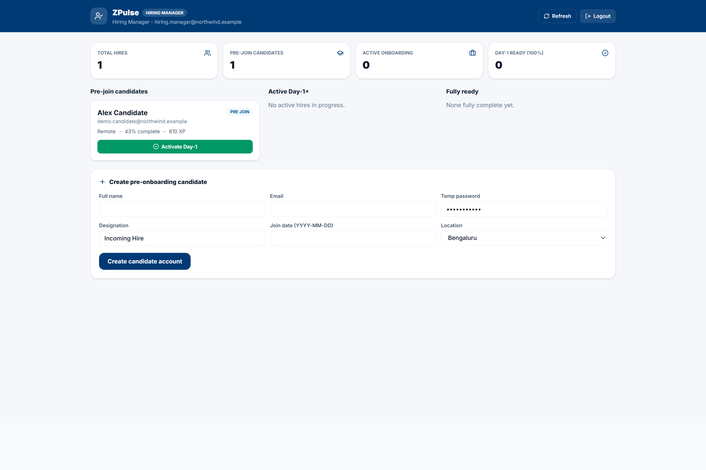

### Administrator
The administrative view over the platform.
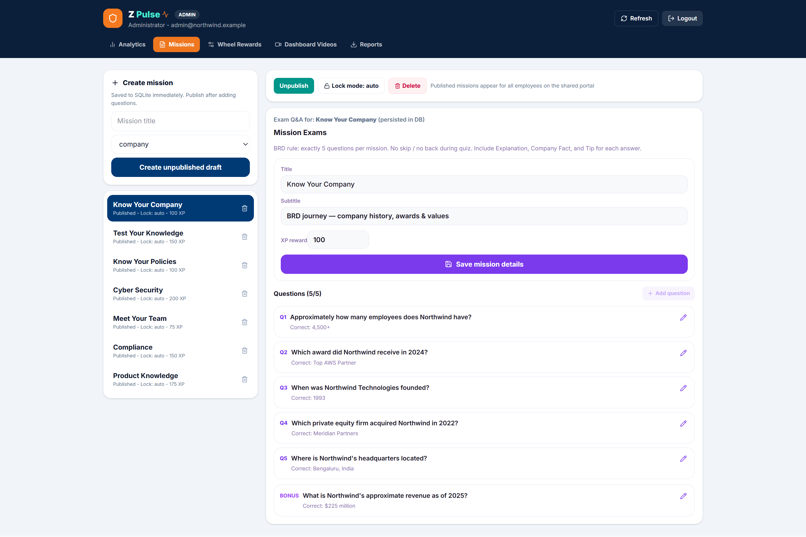

## Status

I worked out where this belongs in the candidate journey — that the gamified core earns its keep specifically in the accept-to-day-one window, not earlier during interviewing and not after joining — and then built it. Every screen above is running software with a live database behind it: the missions were genuinely completed to produce the XP, badges and certificate shown, and the HR assistant answers live rather than replaying canned text. The applicant-tracking sync is real but is shown here against a stand-in rather than a live recruiting system.

---

*Source code is not published. This repository is a visual walkthrough of the working application.*
